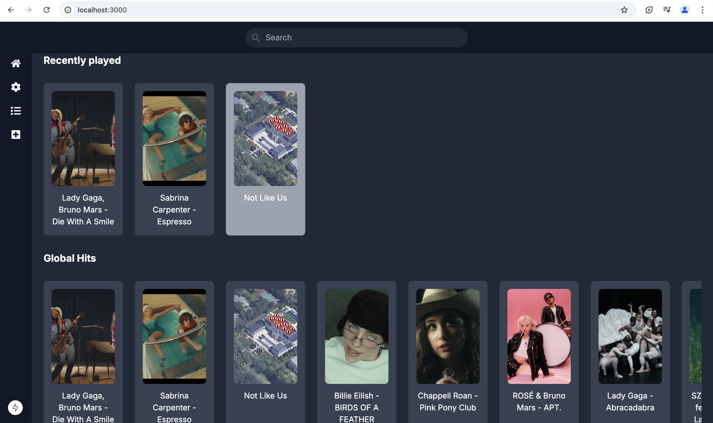
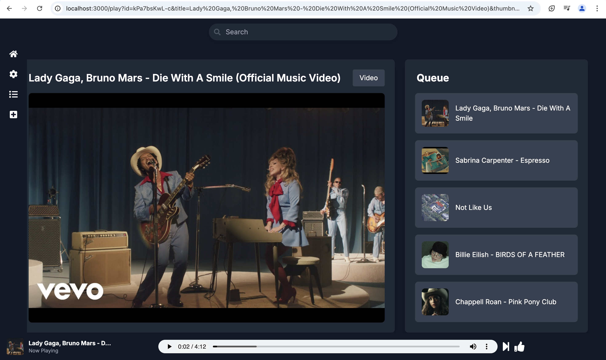
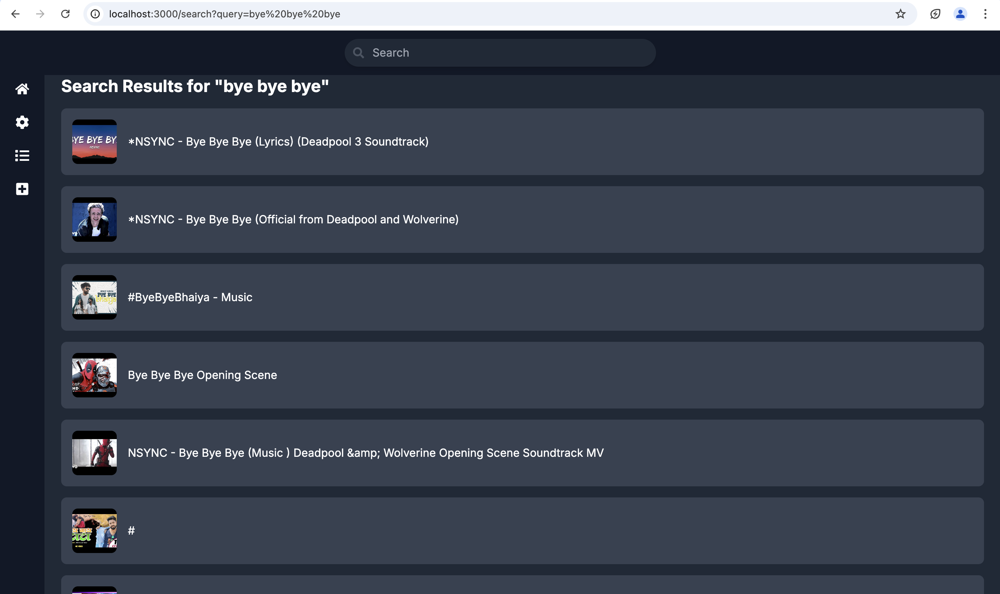
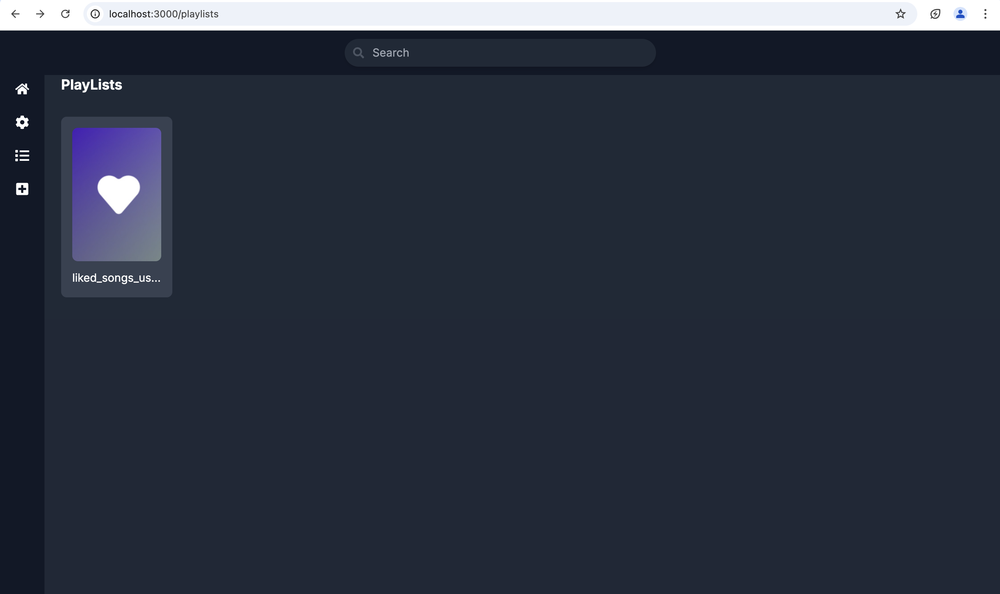
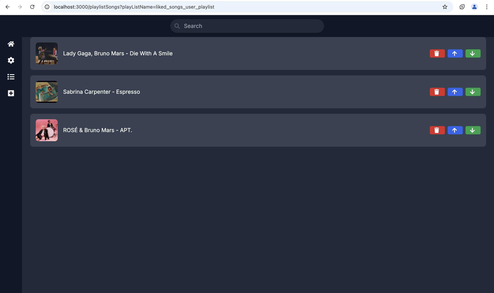

# Shadow Beats Web

Shadow Beats Web is open source modern music streaming application designed to offer a seamless and enjoyable listening experience. it allows users to discover trending tracks, curate personal playlists, and enjoy uninterrupted playback. The app is built for effortless navigation and smooth performance.

## Features

- **Popular Songs Catalog**
  - Globally trending songs
  - Trending Bollywood songs
  - Currently popular Korean songs
- **Seamless Playback**
  - Switch between audio and video while playing
  - Continuous playback of the next song in the playlist
- **User Interaction**
  - Add songs to "Liked Songs"
  - Search feature
- **Performance Optimization**
  - Caching of upcoming songs

## Screenshots

#### home 
 
#### song/video playback

#### search

#### playlists

#### Saved songs

### Upcoming Features

- Improved song recommendations
- Bug fixes and optimizations

## Prerequisites

Before running the application, ensure that the [Shadow Beats Core](https://github.com/shadowgarden300/shadow-beats-core) service is running.

## Installation and Setup

Shadow Beats Web is built with Next.js. Follow these steps to run the application locally:

1. Clone the repository:
   ```sh
   git clone <repository_url>
   cd shadow-beats-web
   ```
2. Install dependencies:
   ```sh
   npm install
   ```
3. Set up the environment variables:
   Create a `.env.local` file in the project root and add the following values:
   ```env
   YOUTUBE_API_KEY="your_youtube_api_key"
   NEXT_PUBLIC_BACKEND_BASE_URL="http://127.0.0.1:5000"
   ```
   - To obtain a YouTube API Key, follow [this guide](https://developers.google.com/youtube/registering_an_application).
4. Start the application:
   ```sh
   npm run dev
   ```
   The app will be available at `http://localhost:3000`.


---

For any issues or contributions, feel free to open a pull request or create an issue in the repository.

